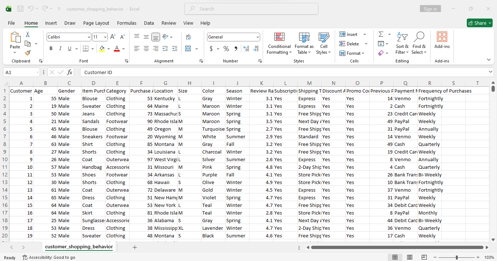
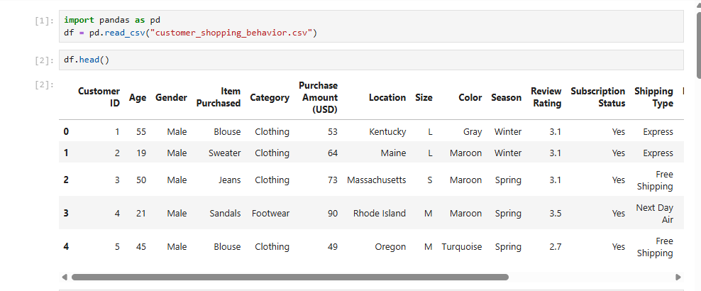
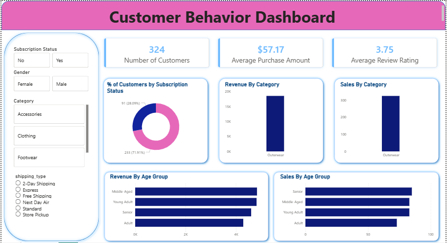

# Customer Behavior Analysis
End-to-end data analytics portfolio project (Python, SQL, Power Bi) inspired by Amlan Mohanty’s YouTube tutorial, focusing on data cleaning, exploratory analysis, and business-driven insights for e-commerce companies
## 📌 Project Overview

This project analyzes a retail company’s customer shopping behavior to uncover actionable insights that can help improve sales performance, customer engagement, and marketing strategies.

Using Excel, Python (Pandas), PostgreSQL, and Power BI, the project follows a complete data analytics workflow — from data validation and cleaning to SQL-based business analysis and interactive dashboard visualization.

The analysis simulates a real-world e-commerce use case applicable to companies such as Amazon, Jumia, and Konga.

## 🧩 Business Problem

A leading retail company wants to better understand how customers shop across different demographics, product categories, and purchase conditions (discounts, subscriptions, shipping types, seasons, and reviews).

Core Business Question

How can the company leverage consumer shopping data to identify trends, improve customer engagement, and optimize marketing and product strategies?

## 🗂️ Dataset Description

The dataset contains customer-level transactional data, including:

- Customer demographics (Age, Gender)

- Product details (Item Purchased, Category, Size, Color)

- Purchase behavior (Purchase Amount, Discounts, Shipping Type)

- Engagement metrics (Review Ratings, Subscription Status)

- Purchase history (Previous Purchases)

# 🔄 Project Workflow
### 1️⃣ Data Validation & Cleaning (Excel)

Loaded raw CSV data into Excel

Checked for:

Missing values

Data inconsistencies

Incorrect data types

Ensured data quality before analysis



### 2️⃣ Data Exploration & Transformation (Python – Pandas)

Loaded dataset into Jupyter Notebook

Used Pandas for:

Data inspection (head(), info(), describe())

Feature engineering (e.g., age group segmentation)

Preparing clean, analysis-ready data

Exported processed data for SQL analysis


 
Imported Create_Engine and connected with Postgresql


### 3️⃣ Business Analysis Using SQL (PostgreSQL)
The cleaned data was loaded into PostgreSQL to answer key business and performance questions.

🔍 Key Business Questions & SQL Queries
Q1. Total revenue generated by male vs female customers

```sql
SELECT
    gender,
    SUM(purchase_amount) AS revenue
FROM customer
GROUP BY gender;

Q2. Customers who used discounts but spent above the average purchase amount
SELECT 
    customer_id,
    purchase_amount
FROM customer
WHERE discount_applied = 'Yes'
AND purchase_amount >= (
    SELECT AVG(purchase_amount) FROM customer
);

Q3. Top 5 products with the highest average rating
SELECT
    item_purchased,
    ROUND(AVG(review_rating::numeric), 2) AS average_product_rating
FROM customer
GROUP BY item_purchased
ORDER BY average_product_rating DESC
LIMIT 5;

Q4. Average purchase amount by shipping type (Standard vs Express)
SELECT 
    shipping_type,
    ROUND(AVG(purchase_amount), 2) AS avg_purchase_amount
FROM customer
WHERE shipping_type IN ('Standard', 'Express')
GROUP BY shipping_type;

Q5. Spending comparison between subscribed and non-subscribed customers
SELECT 
    subscription_status,
    COUNT(customer_id) AS total_customers,
    ROUND(AVG(purchase_amount), 2) AS avg_spend,
    ROUND(SUM(purchase_amount), 2) AS total_revenue
FROM customer
GROUP BY subscription_status
ORDER BY total_revenue DESC;

Q6. Products with the highest percentage of discounted purchases
SELECT 
    item_purchased,
    ROUND(
        100 * SUM(CASE WHEN discount_applied = 'Yes' THEN 1 ELSE 0 END)
        / COUNT(*),
        2
    ) AS discount_rate
FROM customer
GROUP BY item_purchased
ORDER BY discount_rate DESC
LIMIT 5;

Q7. Customer segmentation (New, Returning, Loyal)
WITH customer_type AS (
    SELECT 
        customer_id,
        previous_purchases,
        CASE
            WHEN previous_purchases = 1 THEN 'New'
            WHEN previous_purchases BETWEEN 2 AND 10 THEN 'Returning'
            ELSE 'Loyal'
        END AS customer_segment
    FROM customer
)
SELECT 
    customer_segment,
    COUNT(*) AS number_of_customers
FROM customer_type
GROUP BY customer_segment;

Q8. Top 3 most purchased products within each category
WITH item_count AS (
    SELECT 
        category,
        item_purchased,
        COUNT(customer_id) AS total_orders,
        ROW_NUMBER() OVER (
            PARTITION BY category 
            ORDER BY COUNT(customer_id) DESC
        ) AS item_rank
    FROM customer
    GROUP BY category, item_purchased
)
SELECT
    item_rank,
    category,
    item_purchased,
    total_orders
FROM item_count
WHERE item_rank <= 3;

Q9. Subscription behavior of repeat buyers
SELECT 
    subscription_status,
    COUNT(customer_id) AS customer_count
FROM customer
WHERE previous_purchases > 5
GROUP BY subscription_status;

Q10. Total revenue by age group
SELECT 
    age_group,
    ROUND(SUM(purchase_amount), 2) AS total_revenue
FROM customer
GROUP BY age_group
ORDER BY total_revenue DESC;
```


### 4️⃣ Data Visualization (Power BI)

Built an interactive Power BI dashboard

Visualized:

Revenue trends

Customer demographics

Product performance

Discount and subscription impact

Designed for business stakeholders



📊 Key Insights

Discount strategies strongly influence product demand

Subscribed customers generate higher lifetime value

Repeat buyers are more likely to subscribe

Certain age groups contribute more to total revenue

Express shipping users show higher average spending

🛠️ Tools & Technologies

- Excel – Data validation & preprocessing

- Python (Pandas) – Data cleaning & transformation

- PostgreSQL – Business analysis with SQL

- Power BI – Dashboard & data storytelling

- GitHub – Version control & portfolio hosting
